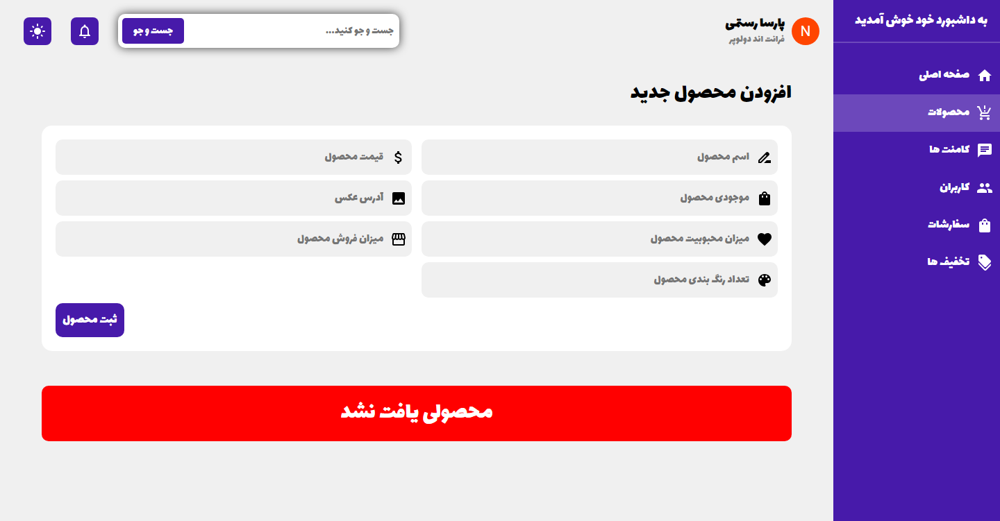

## Persian-CMS
A right-to-left and Persian content management system designed by react and exclusive backend (nodeJS, API, and Mysql) 
You can handle products, users, comments, offers, and ....  

note: The backend of this project is designed by the backend development team, and if there is a problem, the frontend developers are not involved.

